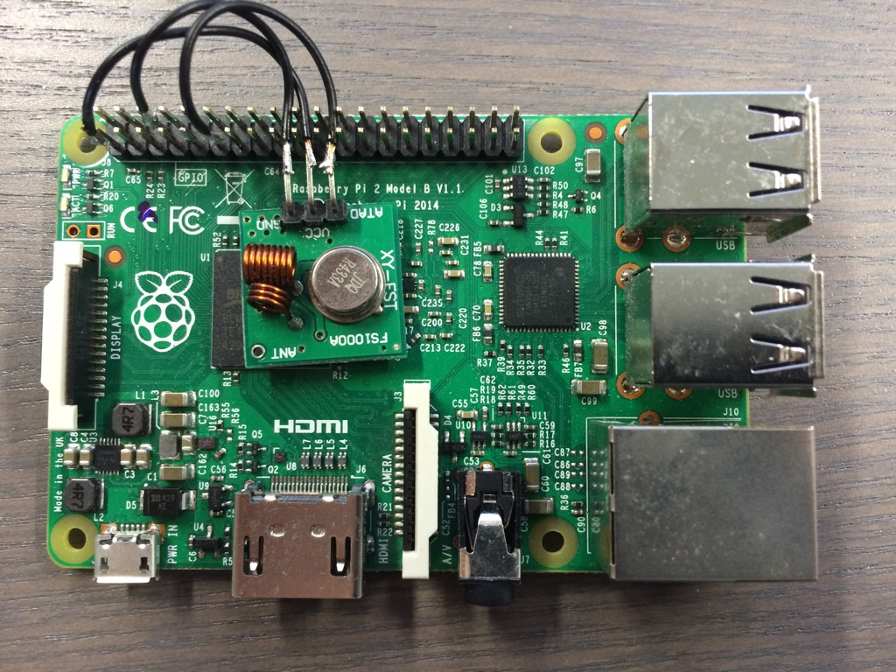

# hkoutlet
Turns [pilight](https://www.pilight.org/) outlets into HomeKit accessory using 
[HomeControl](https://github.com/brutella/hc).

I am using Intertechno IT-1500 outlets together with a 433Mhz sender on the Raspberry Pi.

## TODO
* change outlet to switch
* test with siri
* websocket should reconnect, always, test
* pin as flag

----
* pretty pin dialog like homebridge, that works with iOS cam
* use built in JSON methods https://github.com/golang-samples/websocket/blob/master/websocket-chat/src/chat/client.go#L101
* Remove unneeded map
* Integrate the pilight project, the part I need directly here.
* when refused keep retrying to reconnect but inform the user
* when connection refused don't fail, reconnect
* compare project with homebridge pilight
* find a way to silence ipv6 warning

## Bug NewIPTransport name
If the name contains space it does not work. Check in the source if it works without a fake device. Maybe the API is wrong.

## License
CC BY Yannick Weiss

## Pilight API
### Get Config
`{"action":"request config"}`

### Get Inital Values
`{"action":"request values"}`

### Updates
`{"origin":"update","type":1,"devices":["Switch1"],"values":{"timestamp":1456200104,"state":"off"}}`

### Change Value
`{"action":"control","code":{"device":"Switch1","state":"on"}}`

### Open Questions
* pilight: What does type 1 mean in the update?
* How does a websocket require credentials?

## Credits
* https://github.com/knalli/homebridge-pilight
* https://github.com/brutella/hc
* https://www.pilight.org/
